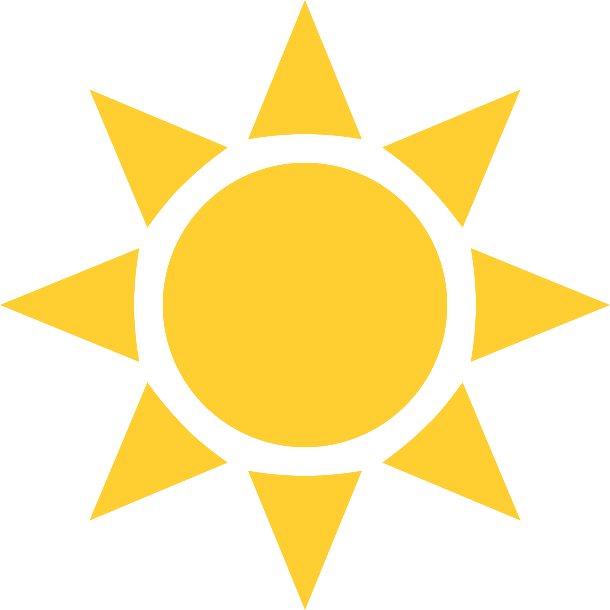

<!-- Improved compatibility of back to top link: See: https://github.com/othneildrew/Best-README-Template/pull/73 -->
<a name="readme-top"></a>
<!--
*** Thanks for checking out the Best-README-Template. If you have a suggestion
*** that would make this better, please fork the repo and create a pull request
*** or simply open an issue with the tag "enhancement".
*** Don't forget to give the project a star!
*** Thanks again! Now go create something AMAZING! :D
-->


<!-- PROJECT SHIELDS -->
<!--
*** I'm using markdown "reference style" links for readability.
*** Reference links are enclosed in brackets [ ] instead of parentheses ( ).
*** See the bottom of this document for the declaration of the reference variables
*** for contributors-url, forks-url, etc. This is an optional, concise syntax you may use.
*** https://www.markdownguide.org/basic-syntax/#reference-style-links
-->
<!-- PROJECT LOGO -->
<br />
<div align="center">
  <a href="https://github.com/SeanOnamade/weather">
    
  </a>

<h3 align="center">SkySleuth!</h3>

  <p align="center">
    Simple Weather App made with JQuery, Javascript, and the OpenWeather API!
    <br />
    <br />
    <br />
    <a href="https://github.com/SeanOnamade/weather">View Demo</a>
    ·
    <a href="https://github.com/SeanOnamade/weather/issues/new?labels=bug&template=bug-report---.md">Report Bug</a>
    ·
    <a href="https://github.com/SeanOnamade/weather/issues/new?labels=enhancement&template=feature-request---.md">Request Feature</a>
  </p>
</div>

<!-- TABLE OF CONTENTS -->
<details>
  <summary>Table of Contents</summary>
  <ol>
    <li>
      <a href="#about-the-project">About The Project</a>
      <ul>
        <li><a href="#built-with">Built With</a></li>
      </ul>
    </li>
    <li>
      <a href="#getting-started">Getting Started</a>
      <ul>
        <li><a href="#installation">Installation</a></li>
      </ul>
    </li>
    <li><a href="#usage">Usage</a></li>
    <li><a href="#roadmap">Roadmap</a></li>
    <li><a href="#license">License</a></li>
    <li><a href="#contact">Contact</a></li>
    <li><a href="#acknowledgments">Acknowledgments</a></li>
  </ol>
</details>


<!-- ABOUT THE PROJECT -->
## About The Project


<br />
<p align="center">
  
</p>

<!-- Here's a blank template to get started: To avoid retyping too much info. Do a search and replace with your text editor for the following: `github_username`, `repo_name`, `twitter_handle`, `linkedin_username`, `email_client`, `email`, `project_title`, `project_description` -->
<p align="right">(<a href="#readme-top">back to top</a>)</p>

### Built With

* [![CSS][CSS.com]][CSS-url]
* [![Javascript][Javascript.com]][Javascript-url]
* [![HTML][HTML.com]][HTML-url]
* [![JQuery][JQuery.com]][JQuery-url]

<p align="right">(<a href="#readme-top">back to top</a>)</p>


<!-- GETTING STARTED -->
## Getting Started

To get a local copy up and running follow these simple example steps.

### Installation

1. Get a free API Key at [https://openweathermap.org/](https://openweathermap.org/)
2. Clone the repo
   ```sh
   git clone https://github.com/SeanOnamade/weather.git
   ```
3. Enter your API in `config.js`
   ```js
   const config = {
       apiKey: 'ENTER YOUR API',
   ```

<p align="right">(<a href="#readme-top">back to top</a>)</p>

<!-- USAGE EXAMPLES -->
## Usage

Use this weather app to find details on any city in the world, such as current temperature, the minimum and maximum for the day, sky conditions, and even the current time!
<br />
<p align="center">
  
</p>

<p align="right">(<a href="#readme-top">back to top</a>)</p>

<!-- ROADMAP -->
## Roadmap

- [X] Clean, simplistic HTML-CSS styling
- [X] Retrieves weather and timezone data from API to display
- [X] Uses the Google Places API to display an image of the searched city

See the [open issues](https://github.com/SeanOnamade/weather/issues) for a full list of proposed features (and known issues).

<p align="right">(<a href="#readme-top">back to top</a>)</p>

<!-- LICENSE -->
## License

Distributed under the MIT License. See `LICENSE.txt` for more information.

<p align="right">(<a href="#readme-top">back to top</a>)</p>

<!-- CONTACT -->
## Contact

SeanOnamade - [linkedin-url]- sean.d.onamade@vanderbilt.edu

Project Link: [https://github.com/SeanOnamade/weather](https://github.com/SeanOnamade/weather)

<p align="right">(<a href="#readme-top">back to top</a>)</p>

<!-- ACKNOWLEDGMENTS -->
## Acknowledgments

* [Tutorial](https://www.skillshare.com/en/classes/learn-html-css-javascript-jquery-and-apis-build-a-weather-site/428313588/projects)

<p align="right">(<a href="#readme-top">back to top</a>)</p>


<!-- MARKDOWN LINKS & IMAGES -->
<!-- https://www.markdownguide.org/basic-syntax/#reference-style-links -->
[contributors-shield]: https://img.shields.io/github/contributors/SeanOnamade/weather.svg?style=for-the-badge
[contributors-url]: https://github.com/SeanOnamade/weather/graphs/contributors
[forks-shield]: https://img.shields.io/github/forks/SeanOnamade/weather.svg?style=for-the-badge
[forks-url]: https://github.com/SeanOnamade/weather/network/members
[stars-shield]: https://img.shields.io/github/stars/SeanOnamade/weather.svg?style=for-the-badge
[stars-url]: https://github.com/SeanOnamade/weather/stargazers
[issues-shield]: https://img.shields.io/github/issues/SeanOnamade/weather.svg?style=for-the-badge
[issues-url]: https://github.com/SeanOnamade/weather/issues

[linkedin-shield]: https://img.shields.io/badge/-LinkedIn-black.svg?style=for-the-badge&logo=linkedin&colorB=555
[linkedin-url]: https://linkedin.com/in/seanonamade

[OpenWeather-url]: https://openweathermap.org/ 

[HTML.com]: https://img.shields.io/badge/HTML-239120?style=for-the-badge&logo=html5&logoColor=white
[HTML-url]: https://developer.mozilla.org/en-US/docs/Web/HTML 
[CSS.com]: https://img.shields.io/badge/CSS-239120?&style=for-the-badge&logo=css3&logoColor=white
[CSS-url]: https://www.w3schools.com/css/
[Javascript.com]: https://img.shields.io/badge/JavaScript-F7DF1E?style=for-the-badge&logo=javascript&logoColor=black
[Javascript-url]: https://www.w3schools.com/js/
[React.js]: https://img.shields.io/badge/React-20232A?style=for-the-badge&logo=react&logoColor=61DAFB
[React-url]: https://reactjs.org/

[JQuery.com]: https://img.shields.io/badge/jQuery-0769AD?style=for-the-badge&logo=jquery&logoColor=white
[JQuery-url]: https://jquery.com 
